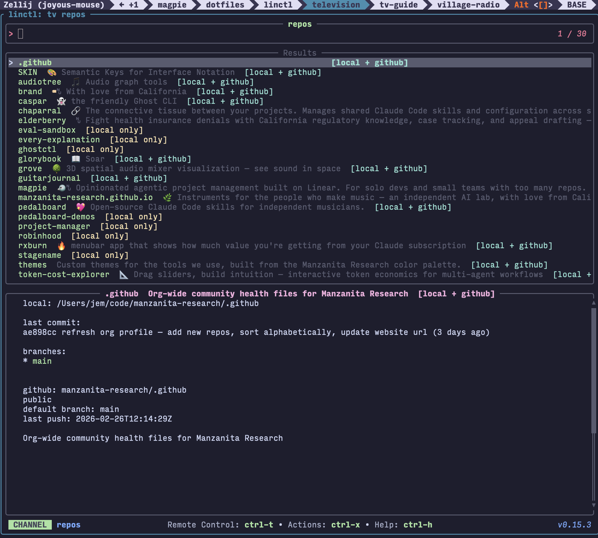
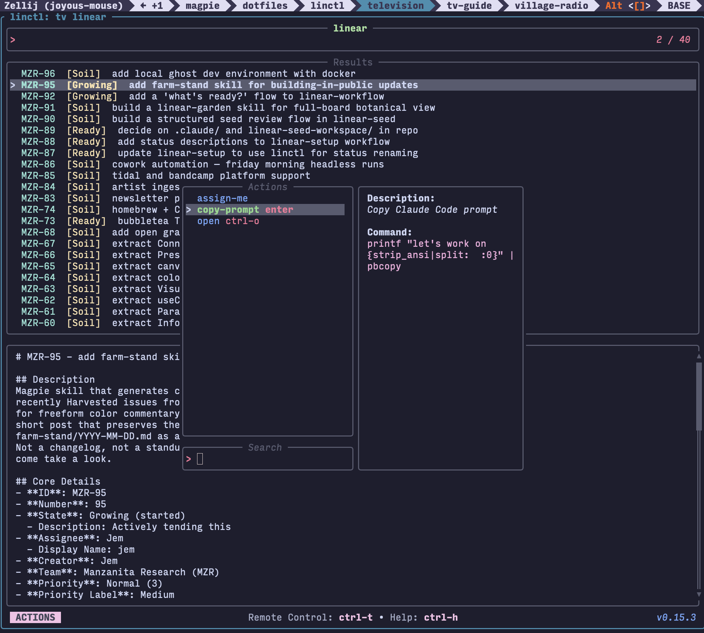

# tv-guide

Custom [television](https://github.com/alexpasmantier/television) channels for the tools we actually use — Linear, GitHub orgs, and (eventually) [Caspar](https://github.com/manzanita-research/caspar).

Television is a fast, hackable fuzzy finder for the terminal. These channels wire it into our workflow.





## Channels

| Channel | Command | What it does |
|---|---|---|
| `repos` | `tv repos` | Browse a GitHub org's repos merged with your local clones. Tags each as `[local + github]`, `[local only]`, or `[github only]`. |
| `linear` | `tv linear` | Fuzzy search all Linear issues. Preview shows full detail. Enter copies a Claude Code prompt. |
| `my-issues` | `tv my-issues` | Same, filtered to issues assigned to you. |
| `caspar` | `tv caspar` | Placeholder for when Caspar ships. |

## Install

```sh
brew install television
tv update-channels

git clone https://github.com/manzanita-research/tv-guide.git
cd tv-guide
./install.sh
```

The install script symlinks channels into `~/.config/television/cable/`.

The Linear channels (`linear`, `my-issues`) require [linctl](https://github.com/dorkitude/linctl) — follow the install instructions in that repo.

## Configuration

The `repos` channel reads two environment variables. Add these to your `.zshrc` / `.bashrc`:

```sh
export TV_GH_ORG="manzanita-research"    # your github org or username
export TV_CODE_DIR="$HOME/code/manzanita-research"  # where you clone repos locally
# TV_CODE_DIR defaults to ~/code/$TV_GH_ORG if unset
```

The `linear` channel reads `TV_LINEAR_STATUS` to filter by issue state. Pair it with shell aliases:

```sh
alias tv-seeds='TV_LINEAR_STATUS=Seeds tv linear'
alias tv-soil='TV_LINEAR_STATUS=Soil tv linear'
alias tv-growing='TV_LINEAR_STATUS=Growing tv linear'
alias tv-ready='TV_LINEAR_STATUS=Ready tv linear'
```

These map to [magpie](https://github.com/manzanita-research/magpie) statuses — you can use any Linear state name (e.g. `Backlog`, `In Review`, `Done`).

Without the env var, `tv linear` shows all issues.

## Requirements

- [television](https://github.com/alexpasmantier/television)
- [linctl](https://github.com/dorkitude/linctl) (for Linear channels)
- [gh](https://cli.github.com/) (for repos channel)
- `jq`

## Keybindings

**repos:**
- `enter` — open in new Zellij tab
- `ctrl-o` — open on GitHub
- `ctrl-c` — clone repo locally
- `ctrl-d` — cd into local clone

**linear / my-issues:**
- `enter` — copy Claude Code prompt to clipboard
- `ctrl-o` — open issue in browser
- `assign-me` action — assign issue to yourself

## Adding a channel

Drop a `.toml` file in `channels/`. The existing channels are good templates. See the [television docs](https://alexpasmantier.github.io/television/) for the full cable channel spec.
